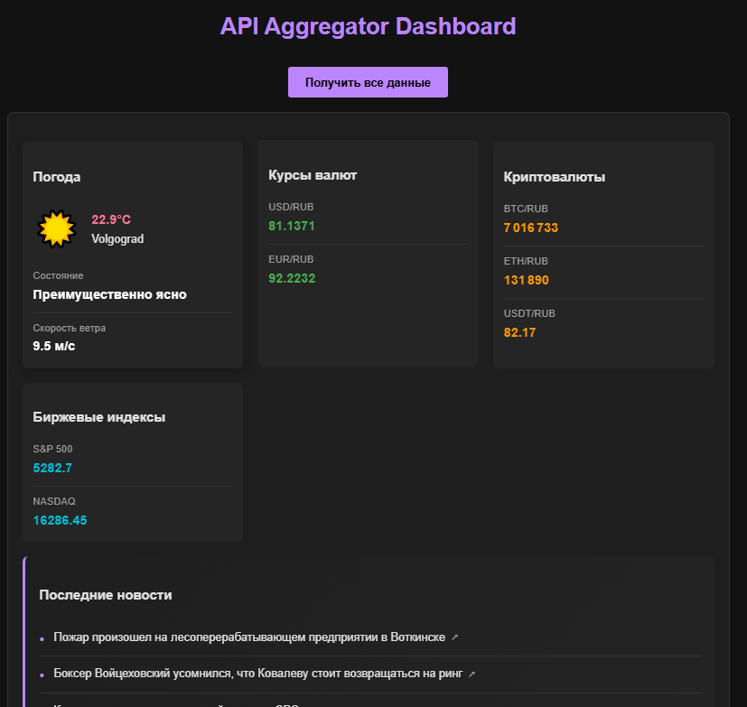

# 📊 API Aggregator
> [!NOTE]
> Учебный backend-проект на FastAPI для сбора и отображения данных из открытых источников: погода, курсы валют и криптовалют, фондовые индексы и последние новости.

## 📌 Описание проекта
**API-aggregator — это асинхронный backend-сервис, написанный на FastAPI с использованием Pydantic v2, который собирает и кеширует данные из внешних открытых API. Основная задача — предоставить единый агрегатор информации через один HTML-интерфейс и JSON-эндпоинт.**

**Интерфейс представляет собой сгенерированный HTML-шаблон для взаимодействия с FastAPI. При нажатии на кнопку в шаблоне, фронт делает запрос к API, где дальше происходит:**

- определение IP пользователя и его города

- получение текущей погоды по координатам

- получение курса валют и криптовалют

- отображение биржевых индексов (S&P 500 и другие)

- парсинг новостей с новостного портала по RSS

# ⚙️ Основной функционал:
### 🌍 Погода:

- Определение местоположения пользователя по IP

- Получение текущей погоды из Open-Meteo API

- Отображение погодных условий с иконками

## 💱 Финансы:

- Курсы валют (по отношению к рублю)

- Курсы популярных криптовалют (Bitcoin, Ethereum)

- Актуальные биржевые индексы (S&P 500 и другие)

## 📰 Новости:

- RSS-парсинг с новостного портала

- Возможность изменить источник новостей через константы

## 🧠 Кеширование:

- Redis используется для кеша с TTL от 5 минут (можно легко изменять в декораторах)

- Кеш реализован с помощью собственных декораторов

- Отдельные ключи кеша на основе типа данных (погода по городу)

## 🐳 Docker-окружение
Проект полностью контейнеризирован:

- FastAPI-приложение

- Redis(cache)

## 🚀 Запуск проекта
Клонировать репозиторий:
```  
git clone https://github.com/L1inkoln/api-aggregator.git
cd api-aggregator
```
Запустить проект:

- docker compose up --build
# 📷 Интерфейс

